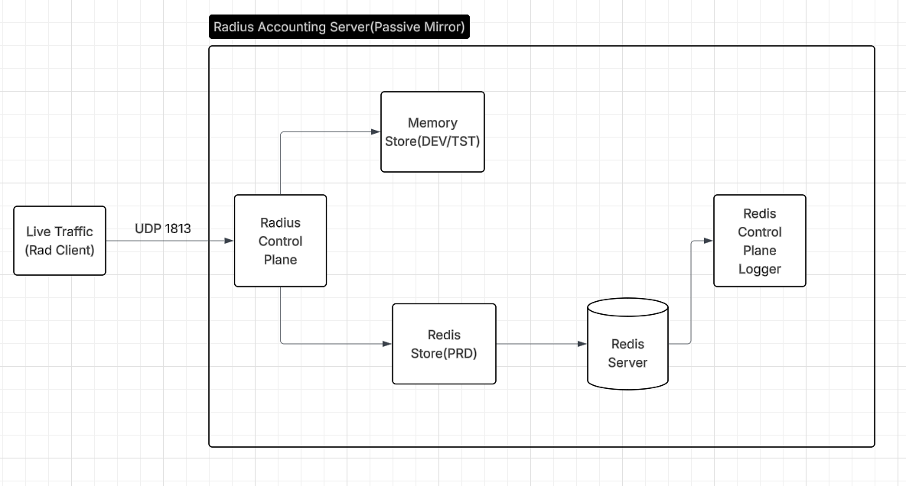

# RADIUS Accounting Server (RAS)

RAS processes mirrored RADIUS accounting traffic for monitoring and data collection. It receives Accounting Requests packets, extracts session attributes and stores them with configurable TTL and responds withAccounting response packets

Note:

This server receives a copy of live RADIUS traffic. It doesn't perform authentication.

## Architecture



## Start — Docker Compose

```bash
docker-compose up --build
```

This launches four containers:

1. radius-controlplane : The main Go application receives RADIUS Accounting-Request packets, stores data, and sends Accounting-Response packets.
2. redis : Redis database instance, configured with Keyspace Notifications enabled.
3. redis-controlplane-logger : The second Go application — subscribes to Redis Keyspace Notifications and logs events to a persistent log file.
4. radclient-test : A container with freeradius-utils installed, used to send test radclient commands to the radius-controlplane service.

## Storage Backends

--> `in-memory` :Development and testing — no external dependencies
 
--> `redis`     :Production — persistent, TTL-based expiry handled by Redis

Verify subscriber log:

docker compose exec redis-controlplane-logger cat /var/log/radius_updates.log

------------------------------------------------------------------------------------------------------------------------------------------------------------------------------------------------------------

Running — Testing (in-memory backend)

docker compose -f docker-compose.testing.yaml up --build

Launches two containers:

1. radius-controlplane — RADIUS server using in-memory storage
2. radclient-test — sends test Start and Stop packets

No Redis or subscriber needed.

------------------------------------------------------------------------------------------------------------------------------------------------------------------------------------------------------------

Unit Tests

go test ./internal/store/ -v -race

Assumptions:

1: Logs streamed to stdout

2: Random record deleted when max limit hit. This is not LRU/LFU — it's a deliberate simplicity trade-off for a dev/test backend.

3: Single UDP listener is started.  Worker pool size can be tuned based on load requirements.


    

